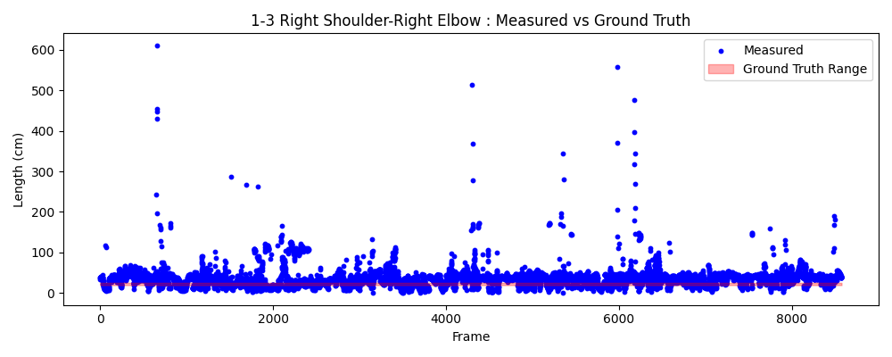
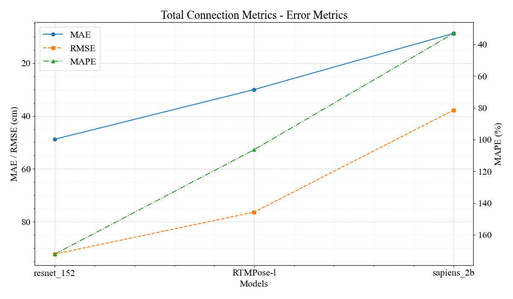

# KeyLength
## Introduction
This project focuses on **measuring human body dimensions using keypoint estimation and depth data**, enabling non-contact body size measurement. By utilizing an image with depth data, the system can determine the body dimensions of a person within the image.

### Skeleton connection
This project uses 12 keypoints (excluding face keypoints) and defines the following skeleton connections:

| Connection ID | Description | Group |
|--------------|-------------|--------|
| 0-1 | Shoulder connection | upper_body |
| 0-2 | Left Shoulder-Left Elbow | upper_body |
| 2-4 | Left Elbow-Left Wrist | upper_body |
| 1-3 | Right Shoulder-Right Elbow | upper_body |
| 3-5 | Right Elbow-Right Wrist | upper_body |
| 0-6 | Left Shoulder-Left Pelvis | upper_body |
| 1-7 | Right Shoulder-Right Pelvis | upper_body |
| 6-7 | Pelvis connection | upper_body |
| 6-8 | Left Pelvis-Left Knee | lower_body |
| 8-10 | Left Knee-Left Ankle | lower_body |
| 7-9 | Right Pelvis-Right Knee | lower_body |
| 9-11 | Right Knee-Right Ankle | lower_body |

The keypoint indices are:
- 0: Left Shoulder
- 1: Right Shoulder
- 2: Left Elbow
- 3: Right Elbow
- 4: Left Wrist
- 5: Right Wrist
- 6: Left Pelvis
- 7: Right Pelvis
- 8: Left Knee
- 9: Right Knee
- 10: Left Ankle
- 11: Right Ankle

## How to use
Your directory should be like this :
```
./datasets/
└── img_with_depth
    ├── bin
    │   └depth_matrix_001.bin
    │   └depth_matrix_002.bin
    │   └depth_matrix_003.bin
    │   ...
    │
    └── color_images
        └frame_001.jpg
        └frame_002.jpg
        └frame_003.jpg
        ...
```
and, also you can use **PNG** type for depth_matrix.
### Trimmed mean & Z-score
You can set trimmed mean and Z-score anomaly detect. Refer to **[Args](#args)** for more information.
### Custom range Ground Truth
The body dimension can not be same all time. If you want make the ground truth have range, modify [`CUSTOM_GROUND_TRUTH_CONFIG`](image_depth_inference.py#L40-L53) and use "*--use_custom_range_gt*".
## Result
This project provides three types of visualization graphs and detailed analysis files for evaluating measurement results:  

For the calculation of Precision and Recall, the terms are defined as follows:
- **Positive**: A distance was successfully measured between two keypoints.
- **Negative**: The distance could not be measured due to missing keypoints.
- **True Positive (TP)**: The measured distance is within the acceptable error range of the ground truth.
- **False Positive (FP)**: The measured distance is outside the acceptable error range.
- **False Negative (FN)**: The distance was not measured when it should have been.

### 1. Analysis Graphs
- **Boxplot**: Shows the distribution of measurements for each skeleton connection
- **Histogram**: Displays the frequency distribution of measurements for each connection
- **Frameplot**: Time-series graph comparing frame-by-frame measurements with ground truth values

All graphs are generated separately for upper body and lower body groups.

### 2. Analysis File
The **analysis.out** file includes detailed statistical analysis:
- Total frame count and valid frame ratio
- Statistics for each skeleton connection:
  - Average length
  - Standard deviation
  - Measurement range
  - MAE
  - RMSE
  - MAPE
  - Precision
  - Recall

**Frameplot Example**  


### 3. Comparative Analysis
Use [output/compare_analysis.py](./output/compare_analysis.py) to compare multiple experimental results:
- **Bar Graph**:  Bar graph for comparing measurements across experiments
- **Radar Graph**: Normalized radar chart for visualizing performance metrics of each skeleton connection

**Bar example**


*All results are saved in the `output` directory, with separate subdirectories created for each experiment.*
## Args

| Argument                  | Description                                                                                              | Default Value        | Required |
| ------------------------- | -------------------------------------------------------------------------------------------------------- | -------------------- | :------: |
| `--model`                 | Path to the ONNX model file for keypoint estimation.                                                     | `./onnx/model.onnx`  | No       |
| `--dataset`               | Path to the dataset directory. This directory must contain a `color_images` subdirectory.                | -                    | **Yes**  |
| `--output`                | Path to the directory where results (images, analysis files) will be saved.                              | `./output`           | No       |
| `--png_depth_dir`         | Path to the root directory for PNG depth files. If provided, this is used instead of the `bin` directory.  | `None`               | No       |
| `--use_custom_range_gt`   | A flag to enable range-based Ground Truth (GT) using the `CUSTOM_GROUND_TRUTH_CONFIG` in the code.         | `False`              | No       |
| `--gt_range_multiplier`   | A multiplier for the standard deviation when calculating range-based GT. Only active if `--use_custom_range_gt` is set. | `1.0`                | No       |
| `--details`               | A flag to print detailed keypoint depth and distance information for each frame to the console.          | `False`              | No       |
| `--trim`            | The ratio of data to trim from each end (min and max) for statistical analysis (e.g., 0.1 for 10%).      | `0.1`                | No       |
| `--use_extension`         | A flag to enable the anomaly detection and correction feature on the calculated distances.                 | `False`              | No       |
| `--window_size`           | The window size for the anomaly detector. Set to `-1` for global, `0` for cumulative, `>0` for sliding window. | `5`                  | No       |
| `--json`           | Path to the json file directory which contains keypooint coordinates. Use this argument if already have information about keypoints. | `None`                  | No       |
| `--accuracy-threshold`    | Threshold in cm to determine a True Positive for precision/recall calculation.                           | `5.0`                | No       |